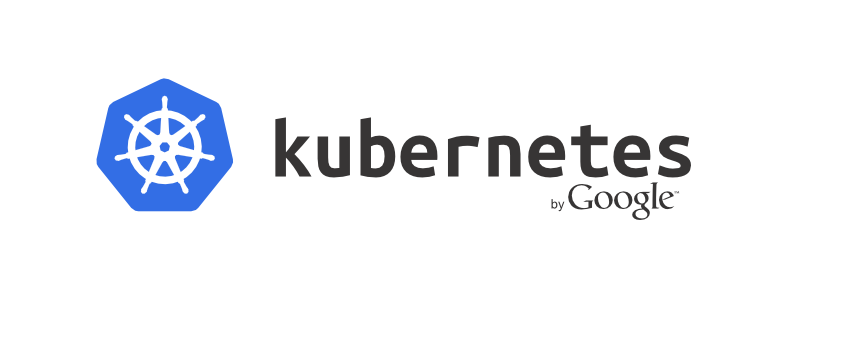

# Learning the Kubernetes Basics

### History of Kubernetes
https://en.wikipedia.org/wiki/Kubernetes

### Try Kubernetes Online
https://www.katacoda.com/courses/kubernetes

### Do you have a VM?
Make sure you have a VM

### Installing Minikube
Use this guide to [install Kubernetes on any machine with Docker](https://github.com/kubernetes/minikube)

### All free Kubernetes online guides
https://kubernetes.io/docs/tutorials/online-training/overview/

### Full Docker Docs Guide
https://kubernetes.io/docs/home/
