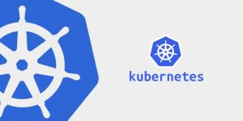

# Kubernetes Basics
> Getting up and running and learning Kubernetes from an end user perspective

## Purpose
Kubernetes does not have a low learning curve. Kubernetes is a platform for building platform, but its far from the endgame. This repository aims to help teach the basics so that you can get up and running in about two and a half weeks.

### The definition of done is as follows:
- [ ] The basics of Linux - installing things, dealing with file permissions, command cheat sheet, and learning git
- [ ] The basics of Docker - Installing, Running, Building and Pushing docker containers
- [ ] The basics of Kubernetes - Architecture, Installing, Deploying your first application
- [ ] The basics of Helm - Understanding package management and easing the pains of yaml
- [ ] The basics of Rancher - Adding user interface to the madness
- [ ] A deeper dive into Kubernetes - Secrets, Storage, Networking, Ingress, and so much more
- [ ] Down the Rabbit hole of Kubernetes - An overview on Operators
- [ ] Deeper and Deeper - A few words on service meshs, containerizing the virtual machine, and serverless
- [ ] Putting it all together and Understanding where we are going
